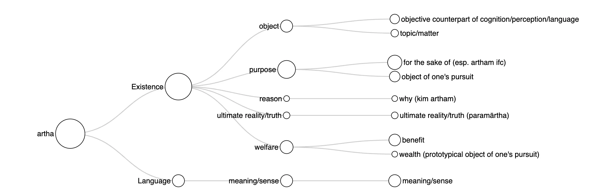
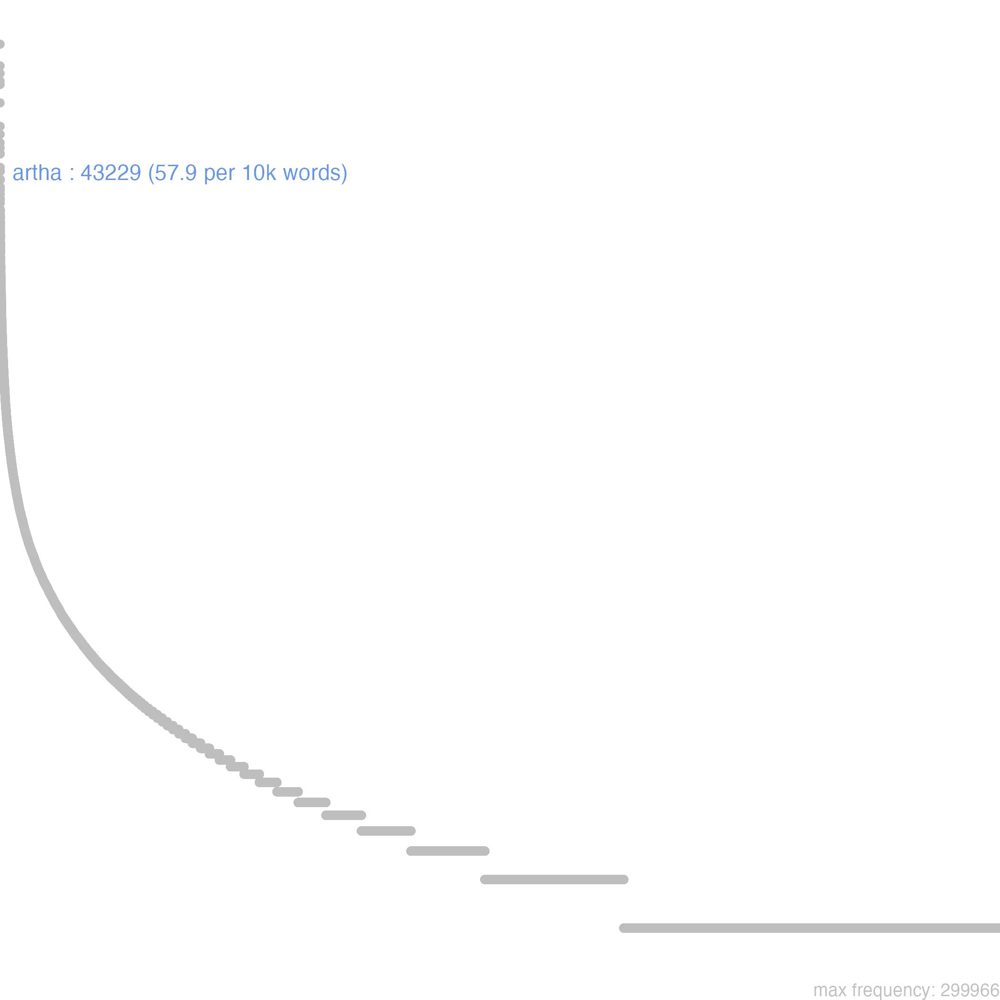
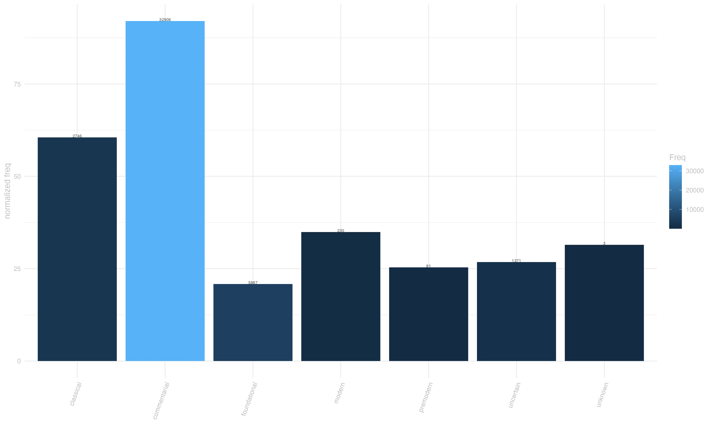
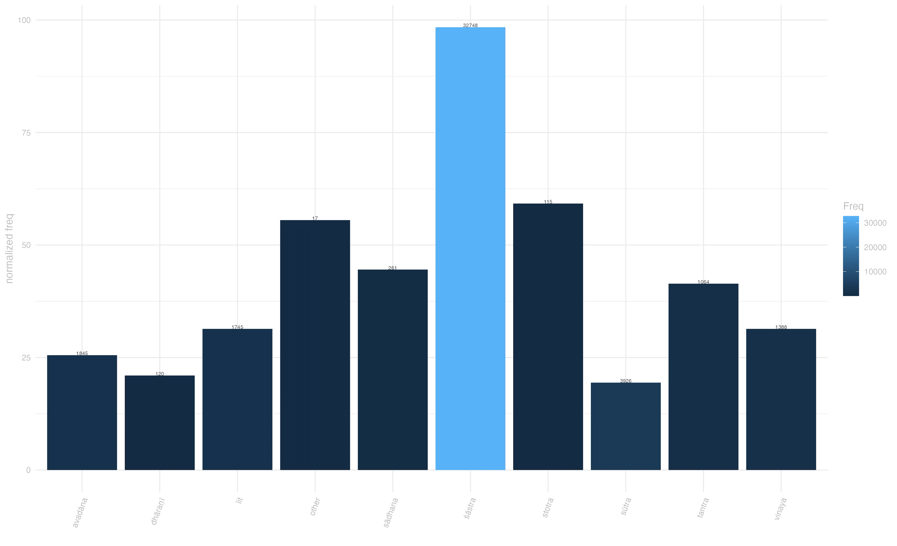
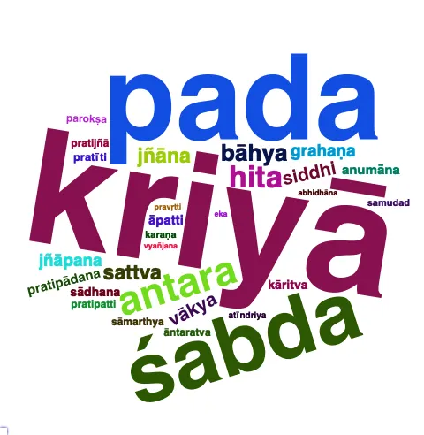

### overview {#sec-overview}

*Artha* expresses many different meaning, predominantly withing the semantic domain of `Existence`. expressing the idea of an external object that is out there for being perceived, possessed, achieved, described, referred to. From this general idea, in our corpus artha encompasses notions that range from a concrete "**object (as the counterpart of cognition or perception)**", in philosophical discussions as well as in narrative texts (*abhidharmakośabhāṣya* 142.18; *buddhacarita* 3.51); to the less concrete "**purpose"** (particularly in the frequent construction *artham* with instrumental case), especially in narrative contexts (*aśokāvadāna* 45; *saddharmapuṇḍarīka* 190), and "**welfare/benefit" (***sukhāvatīvyūhaLargerSūtra* 24); up to the abstract notion of "**ultimate reality/truth"** (in the compounded form *paramārtha*), although in our corpus it is common to found it used as a categorical expression, rather than a term of philosophical discussion (this is why it is usually found in oblique cases, *ratnāvalī* 2.11). Along these ideas, artha is also used in idiomatic, collocational expressions conveying the sense of "**for the sake of (esp. artham ifc)"** and "**why (kim artham)"**. Related to the previous senses, within the domain of **`Language`** artha expresses the idea of "**meaning/sense",** as being the counterpart of a word. The distinction between the domain of Existence and that of Language is not always discrete, especially in abhidharmic contexts and discussions about the proper comprehension of words, where the ideas of meaning and referent may overlap (*abhidharmakośabhāṣya* 80).

 Genre and Temporal Distribution

The lemma *artha* is well represented across diverse Buddhist genres, with śāstra literature most heavily represented, followed by sūtra and other genres including avadāna literature and specialized texts. This distribution reflects the term's importance in both doctrinal exposition and narrative contexts.

Temporally, artha is uniformly distributed over all the diachronic layers considered in this dictionary, spanning from foundational, through classical, to commentarial periods, with some uncertain datings. The Yogācāra tradition is particularly well-represented, alongside general Buddhist usage, suggesting artha's centrality to Yogācāra philosophical discourse.

### frequency {#sec-frequency}

Analysis of the complete Buddhist Sanskrit corpus reveals *artha* as a high-frequency word with particularly dense usage in śāstra literature, followed by stotra and tantra. Sūtra literature, despite its foundational importance, shows relatively lower density, while other genres fall within moderate ranges. The distribution pattern captures the term's semantic complexity and its evolution from basic notions of purpose and meaning to sophisticated philosophical concepts central to Buddhist thought and practice.

::: panel-tabset
## freq graph {#sec-freqcurve}

{#fig-freqcurve}

## freq by period {#sec-periodBars}

{#fig-periodBars}

## freq by genre {#sec-genreBars}

{#fig-genreBars}
:::

### context {#sec-context}

In our corpus, there can be found several significant multi-word expressions featuring *artha*. The construction *X-ārthāya* or *X-ārtham* (for the sake of X) appears frequently, expressing purpose or intention. An adverbial use of artha can be seen in the compounded form *paramārtha* (ultimate reality/truth), as in the *Daśabhūmikasūtra* 31: "kriy\^āpi tatra param\^ārthato n\^opalabhyate" ("Where is no doer, there no action exists in an absolute sense'." \[Honda 189\]).

The interrogative *kim artham* (why/for what purpose) serves as a standard formula for questioning motivation, while compounds like *sva-artha* (one's own benefit) and *par-artha* (others' benefit) reflect fundamental Buddhist ethical distinctions between self-interest and altruism.

 Exemplary Usage

A particularly illuminating example from the Mahāyānasūtrālaṃkāra demonstrates *artha*'s philosophical sophistication: "paratra labdhv\^ātma-samāna-cittatāṃ svato 'dhi vā śreṣṭhatar\^eṣṭatāṃ pare / tath\^ātmano 'ny\^ārtha-viśiṣṭa-saṃjñinaḥ svak\^ārthatā kā katamā par\^ārthatā" - here *artha* appears in the technical compounds *sv-ārtha* and *par-ārtha*, central to Mahāyāna ethics.

{#fig-collocationWC}

### connotation {#sec-connotation}

The semantic prosody analysis reveals *artha*'s predominantly positive or neutral connotations. Positive instances often relate to beneficial purposes or meaningful content, as exemplified in the *Bodhisattvabhūmi* 113: "pareṣāñ c\^**ārth**āya kauśeya-saṃstaraṇa-śatāni niṣadana-saṃstaraṇa-śatāny upasthāpayitavyāni /" ("For the sake of others, \[a bodhisattva\] should also provide \[as many as\] a hundred silk beds and a hundred sitting mats." \[Engle 278\]). Neutral instances typically involve objective reference or technical usage. Notably, negative instances often appear in contexts of negation or critique, such as in the *Jātakamālā* 3.19: "tyaktavyaṃ vivaśena yan na ca tathā kasmaicid **arth**āya yat tan nyāyena dhanaṃ tyajan yadi guṇaṃ kaṃcit samudbhāvayet /" ("One day you will inevitably have to part with your money, and it will be of no use then." \[Khoroche 21\]).

------------------------------------------------------------------------

This entry is based on version 6 of of the Visual Dictionary of Buddhist Sanskrit, see data at zenodo.org/records/13985112
